# ProvCam: A Camera Module with Self-Contained TCB for Producing Verifiable Videos

:paperclip: [ProvCam Paper](https://doi.org/10.1145/3636534.3649383) 

:computer: [ProvCam Main Repository](https://github.com/trusslab/provcam)
This repo hosts the documentation of ProvCam and other misc content. 

:computer: [ProvCam Hardware Repository](https://github.com/trusslab/provcam_hw)
This repo hosts ProvCam's hardware system design.

:computer: [ProvCam Firmware Repository](https://github.com/trusslab/provcam_ctrl)
This repo hosts firmware running the microcontroller of ProvCam trusted camera module.

:computer: [ProvCam OS Repository](https://github.com/trusslab/provcam_linux)
This repo hosts OS(a custom version of Petalinux) running on ProvCam's system. 
Notice that the OS represents the main camera OS, which is untrusted in ProvCam. 

:computer: [ProvCam Software Repository](https://github.com/trusslab/provcam_libs/tree/main)
This repo hosts some software and libraries running in the OS.

Authors: \
[Yuxin (Myles) Liu](https://lab.donkeyandperi.net/~yuxinliu/) (UC Irvine)\
[Zhihao Yao](https://web.njit.edu/~zy8/) (NJIT)\
[Mingyi Chen](https://imcmy.me/) (UC Irvine)\
[Ardalan Amiri Sani](https://ics.uci.edu/~ardalan/) (UC Irvine)\
[Sharad Agarwal](https://sharadagarwal.net/) (Microsoft)\
[Gene Tsudik](https://ics.uci.edu/~gts/) (UC Irvine)

The work of UCI authors was supported in part by the NSF Awards #1763172, #1953932, #1956393, and #2247880 as well as NSA Awards #H98230-20-1-0345 and #H98230-22-1-0308.

We provide a step-by-step guide to recreate ProvCam's hardware and software prototype mentioned in our paper. 

---

## Table of Contents

- [ProvCam](#provcam-a-camera-module-with-self-contained-tcb-for-producing-verifiable-videos)
    - [Table of Contents](#table-of-contents)
    - [System Requirements](#system-requirements)
    - [Hardware Design](#hadware-design)
    - [Firmware](#firmware)
    - [OS](#os)
    - [Run & Debug](#run--debug)

## System Requirements

### Hardware
We use [Xilinx Zynq UltraScale+ MPSoC ZCU106 Evaluation Kit](https://www.xilinx.com/products/boards-and-kits/zcu106.html) and [LI-IMX274MIPI-FMC Camera](https://leopardimaging.com/product/platform-partners/amd/li-imx274mipi-fmc/) in our ProvCam's prototype.
You also need a compatiable SD card (We use a 32 GB SD card), and a USB drive (optional) to copy the captured video without turning the board off. 

### Xilinx Vivado and Vitis
We use Xilinx Vivado 2023.2.1 and Xilinx Vitis 2023.2.1 (https://www.xilinx.com/support/download.html) for designing both hardware and firmware.
Please follow this [official guide](https://www.xilinx.com/support/download.html) provided by Xilinx to install both Vivado and Vitis. 
(You may skip (part or all) Xilix Design Suite installation if you only want to try ProvCam's hardware prototype, as we provide both pre-compiled hardware and firmware)

We use an Intel Xeon E5-2697 CPU with 72 threads with 192 GB memory running Ubuntu 22.04 on a SATA SSD to prepare the hardware and firmware. 
The total machine time is about 3 hours, and it might take around 5-8 hours of manual work time depending on your familiarity with the tools. 

We will call this MACHINE_0 from now on, which runs both Vivado and Vitis.

### Xilinx Petalinux
We use a [custom version of Xilinx Petalinux 2020.1](https://github.com/trusslab/provcam_linux) to reprsents the OS. 
To compile it, the Xilinx's official Petalinux 2020.1 toolset (https://www.xilinx.com/support/download/index.html/content/xilinx/en/downloadNav/embedded-design-tools/archive.html) has to be first installed. 
Please follow this [official guide](https://docs.xilinx.com/v/u/2020.1-English/ug1144-petalinux-tools-reference-guide) provided by Xilinx to install the Petalinux toolset. 
(Again, you may skip the Petalinux toolset installtion if you only want to try ProvCam's hardware prototype, as we provide pre-compiled images)

We use an Intel Core I7-5775C CPU with 8 threads with 16 GB memory running Ubuntu 18.04 on a SATA SSD to prepare the OS.
The total machine time is about 3 hours, and it mgiht take around 3-6 hours of manual work time depending on your familiarity with the tools.

We will call this MACHINE_1 from now on, which is for compiling Petalinux. 
Note that this MACHINE_1 may potentially be the same physical machine as of MACHINE_0, but we recommend the use of two different physical machines for preventing any library conflictions.

### Misc.
You might need a Windows machine to adjust some board's settings (as it appears that the corresponding Xilinx tool is only available in Windows).

## Hadware Design
This section is supposed to be done using MACHINE_0.

1. Clone the hardware repo (`git clone https://github.com/trusslab/provcam_hw`) to `<PATH_TO_PROVCAM_HW_SRC>`. 
2. Open Vivado and create a new hardware project in `<PATH_TO_PROVCAM_VIVADO_HW_DESIGN>`.

3. Make sure that the hardware project is created for the ZCU106 evaluation board. 

4. Add all constraints from `<PATH_TO_PROVCAM_HW_SRC>/constraints/` to the project: File -> Add Sources -> Add or create constraints (Remember to select copy to the project directory).
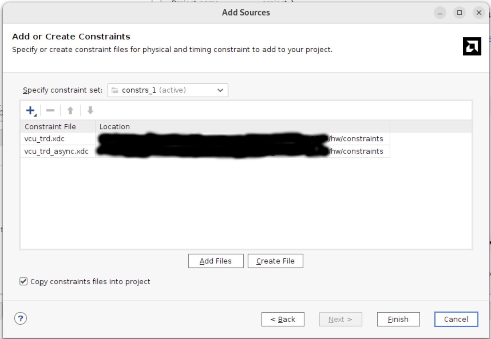
5. Add all sources from `<PATH_TO_PROVCAM_HW_SRC>/sources/` to the project: File -> Add Sources -> Add or create design sources (Remember to select copy to the project directory).

6. In the TCL console, type `source <PATH_TO_PROVCAM_HW_SRC>/bd.tcl` and enter. This will create the entire ProvCam hardware design automatically.
7. After sourcing, in the TCL console, type `regenerate_bd_layout` and enter. You will see a block design similar to the figure below. For a more detailed block deisgn illustration, please refer to [this PDF](docs/pdf/bd.pdf). 
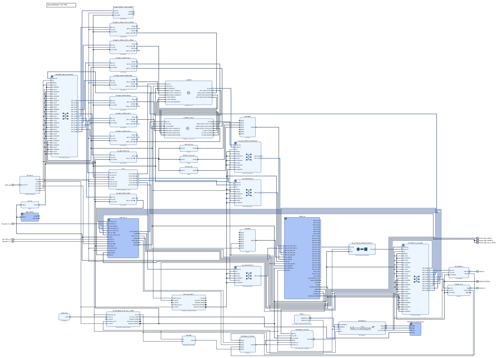
8. Under the Sources Tab (wiht Hierarchy view), select and right click bd (bd.bd).

9. Click "Generate Output Products".
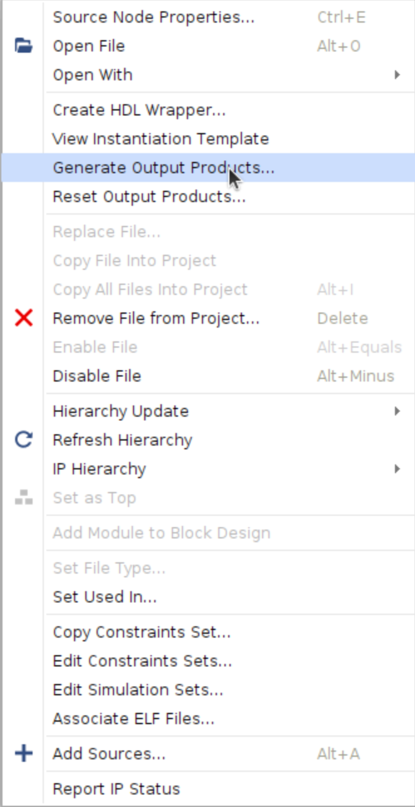
10. Generate the output products with the following options (note that you may choose the number of jobs/threads based on your machine's spec).

11. Repeat step 8, and click "Create HDL Wrapper".

12. Check "Let Vivado manage wrapper and auto-update" and click OK.

13. Under the Sources Tab (wiht Hierarchy view), select and right click the newly generated bd_wrapper (bd_wrapper.v).

14. Click "Set as Top".

15. Generate bitstream. This step might take a few hours depending on your machine. 
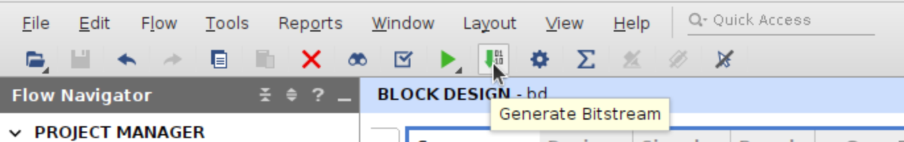
16. Once done, export the hardware to `<PATH_TO_PROVCAM_XSA>`: File -> Export -> Export Hardware. Please remember to select "include bitstream".
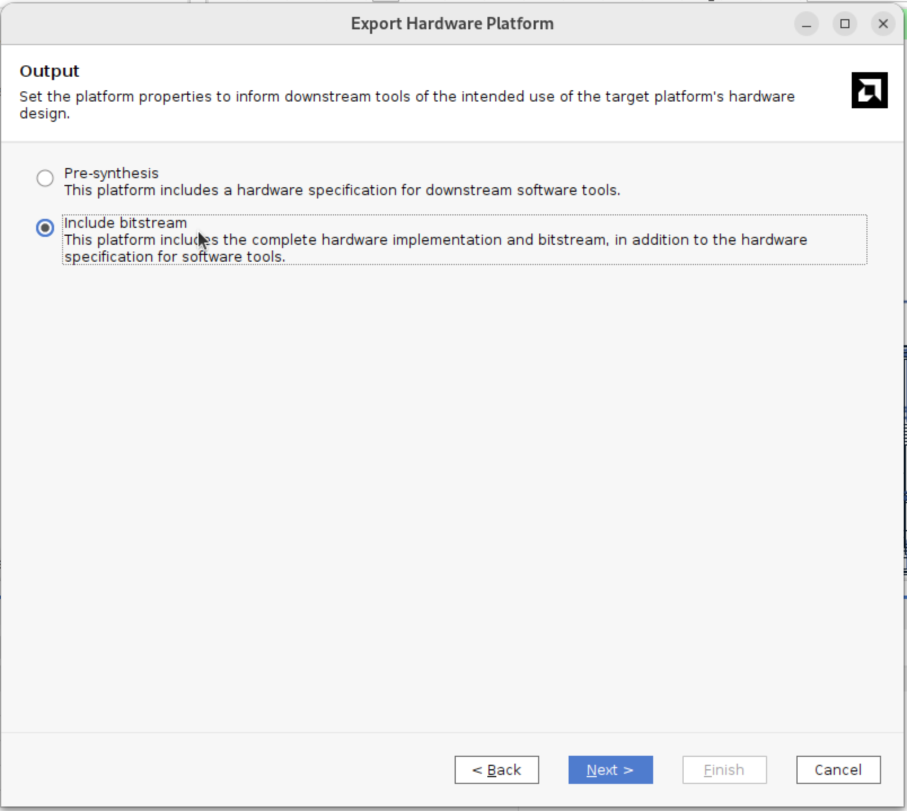

## Firmware
Assuming you have the hardware design XSA file named `PROVCAM_XSA`.\
This section is supposed to be done using MACHINE_0.

1. Clone the firmware repo (`git clone https://github.com/trusslab/provcam_ctrl.git`) to `<PATH_TO_PROVCAM_FW_SRC>`.
2. Open Vitis classic (`vitis -classic`) under a new workspace `<PATH_TO_PROVCAM_FW_WS>`. 
3. Create a new platform project with `PROVCAM_XSA` using the confiration shown in the following figure.
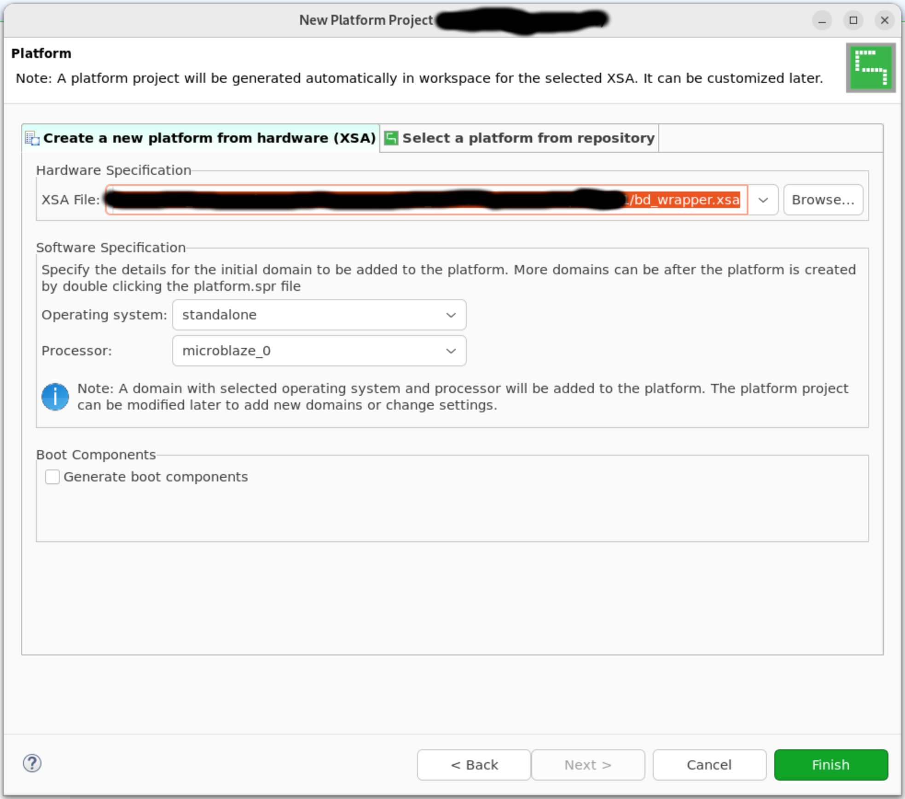
4. Create a new application project named `PROVCAM_FW_APP` with the previously created platform project and its domain. Please remember to select "Hello World" as the development template.
5. Copy (and overwrite) everything inside `<PATH_TO_PROVCAM_FW_SRC>` to the newly created application project's src folder (`<PATH_TO_PROVCAM_FW_WS>/PROVCAM_FW_APP/src/`). 
6. Build the application project: In Vitis's Explorer tab, right click the application project -> Build Project.
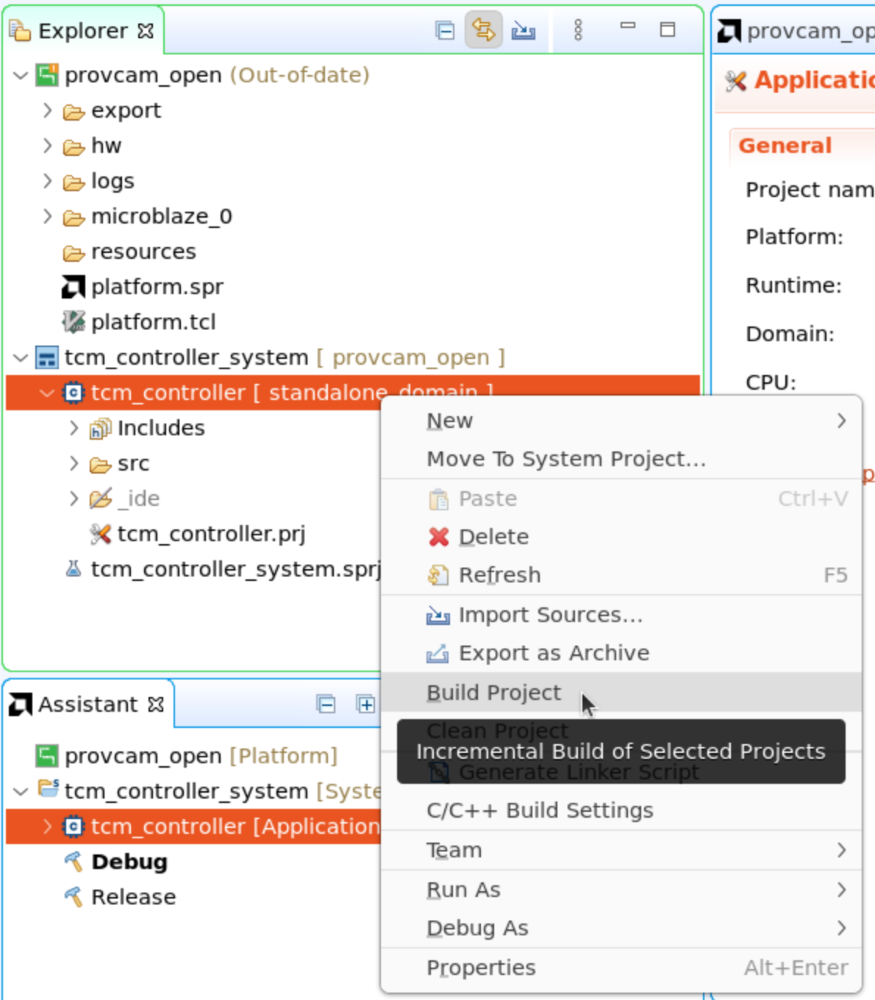
7. Once the build is done, you will find the firmware binary in `<PATH_TO_PROVCAM_FW_WS>/PROVCAM_FW_APP/Debug/PROVCAM_FW_APP.elf`.

## OS
Assuming you have the hardware design XSA file `PROVCAM_XSA` under `<PATH_TO_PROVCAM_XSA>`. Please note the difference between these two terms, as one represents the file itself, and the one represents the directory containing the file.\
Assuming you have the firmware binary `PROVCAM_FW_APP_ELF`.\
Assuming you have the official Petalinux toolset installed at `<PATH_TO_PETALINUX_INSTALLATION>`.\
This section is supposed to be done using MACHINE_1.

1. Download the Xilinx VCU TRD 2020.1 from [this link](https://xilinx-wiki.atlassian.net/wiki/spaces/A/pages/460948332/Zynq+UltraScale+MPSoC+VCU+TRD+2020.1#4.1-Download-the-TRD) and extract it to `<PATH_TO_TRD_SRC>`. (Note that you may need a Xilinx account to access the download link)
2. Clone the OS repo (`git clone https://github.com/trusslab/provcam_linux.git`) to `<PATH_TO_PROVCAM_OS_SRC>`. 
3. Clone the libraries repo (`git clone git@github.com:trusslab/provcam_libs.git`) to `<PATH_TO_PROVCAM_LIBS_SRC>`. 
4. Clone the misc repo (`git clone https://github.com/trusslab/provcam.git`) to `<PATH_TO_PROVCAM_MISC_SRC>`. 
5. Open a terminal and source the Petalinux toolset: `source <PATH_TO_PETALINUX_INSTALLATION>/settings.sh`. 
6. Navigate to the board support package (BSP) directory: `cd <PATH_TO_TRD_SRC>/apu/vcu_petalinux_bsp/`.
7. Create a new Petalinux project: `petalinux-create -t project -s xilinx-vcu-zcu106-v2020.1-final.bsp`, and navigate to the newly created Petalinux project: `cd xilinx-vcu-zcu106-v2020.1-final`. (Assume the path of the Petalinux project from now on is `<PATH_TO_PROVCAM_PETALINUX_PROJECT>`).
8. Copy `<PATH_TO_PROVCAM_MISC_SRC>/project-spec/` to the Petalinux project's directory: `cp -r <PATH_TO_PROVCAM_MISC_SRC>/project-spec/ <PATH_TO_PROVCAM_PETALINUX_PROJECT>/`.
10. Modify first line of `<PATH_TO_PROVCAM_LIBS_SRC>/generate_and_install_patches.sh` to point to the Petalinux project's directory `<PATH_TO_PROVCAM_PETALINUX_PROJECT>`.
11. Execute `<PATH_TO_PROVCAM_LIBS_SRC>/generate_and_install_patches.sh` to generate and install patches for the Petalinux project.
12. Navigate to the Petalinux project's directory: `cd <PATH_TO_PROVCAM_PETALINUX_PROJECT>` and execute `petalinux-config --get-hw-description=<PATH_TO_PROVCAM_XSA>` to configure the project.
13. In the pop-up window, select "Linux Components Selection" -> "linux-kernel" and change to "ext-local-src". Then under the same "Linux Components Selection" menu, select "External linux-kernel local source settings" -> "External linux-kernel local source path" and enter `<PATH_TO_PROVCAM_OS_SRC>`. Exit the configuration menu and save the configuration after that.
14. Build the Petalinux project: `petalinux-build`. This step might take a few hours depending on your machine.
15. After the build is done, navigate to `cd <PATH_TO_PROVCAM_XSA>` and execute `unzip PROVCAM_XSA`. (XSA file is essentially just an archive of the hardware design)
16. Navigate back to the Petalinux project `cd <PATH_TO_PROVCAM_PETALINUX_PROJECT>`, and copy `PROVCAM_FW_APP_ELF` to the Petalinux project's directory: `cp PROVCAM_FW_APP_ELF <PATH_TO_PROVCAM_PETALINUX_PROJECT>/`.
17. Copy `<PATH_TO_PROVCAM_MISC_SRC>/merge_microblaze_elf.sh` to the Petalinux project's directory: `cp -r <PATH_TO_PROVCAM_MISC_SRC>/merge_microblaze_elf.sh <PATH_TO_PROVCAM_PETALINUX_PROJECT>/`.
18. Modify the first four lines to their corresponding values:\
- `VITIS_INSTALLATION` should point to the installation folder of Vitis.\
- `PROJECT_DIR` should point to the Petalinux project's directory (`<PATH_TO_PROVCAM_PETALINUX_PROJECT>`).\
- `XSA_DIR` should point to the directory containing the unzipped XSA file (`<PATH_TO_PROVCAM_XSA>`).\
- `XSA_NAME` should be the name of the XSA file (`PROVCAM_XSA`) without its extension `.xsa`.
19. Execute `<PATH_TO_PROVCAM_PETALINUX_PROJECT>/merge_microblaze_elf.sh` to merge the firmware binary into the Petalinux project. 
20. Navigate to the comiled images of the Petalinux project: `cd <PATH_TO_PROVCAM_PETALINUX_PROJECT>/images/linux/`. (We assume this folder is `<PATH_TO_PROVCAM_PETALINUX_IMAGES>` from now on)
21. Create the boot image: `petalinux-package --boot --fsbl zynqmp_fsbl.elf --u-boot u-boot.elf --pmufw pmufw.elf --fpga system.bit --force`.

## Run & Debug

### Preparing the SD Card
Assuming the directory containing the compiled images of the Petalinux project is `<PATH_TO_PROVCAM_PETALINUX_IMAGES>`.\
This sub-section is supposed to be done using MACHINE_1.

1. Insert the SD card and mount it to `<PATH_TO_PROVCAM_SDCARD>`. (Note that the SD card should be formatted to FAT32)
2. Navigate to `cd <PATH_TO_PROVCAM_PETALINUX_IMAGES>` and copy `BOOT.BIN`, `image.ub` and `boot.scr` to the SD card: `cp BOOT.BIN image.ub boot.scr <PATH_TO_PROVCAM_SDCARD>/`.
3. Unmount the SD card and insert it into the ZCU106 board.

### Hardware Preparation
This sub-section is supposed to be done using MACHINE_0.

1. Connect both JTAG and UART of the board to MACHINE_0.
2. Set the board's SW6 switches to the same configuration as shown in the figure below, which is for telling the board to boot from SD card.
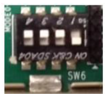
3. Connect the LI-IMX274MIPI-FMC image sensor to the FMC0 connector and set the FMC0's VADJ to 1.2V (please follow [the official guide](https://support.xilinx.com/s/article/67308?language=en_US) to adjust the voltage).

### Preparing the UART Consoles
Assuming you have the ZCU106 evaluation board's UART connected to MACHINE_0.\
This sub-section is supposed to be done using MACHINE_0.

1. Open a terminal and execute `ll -h /dev/serial/by-id/` and you are supposed to see something similar to below. 

2. The first UART port (`ttyUSB9` in the figure above) is used by the ProvCam OS, where the third UART port (`ttyUSB11` in the figure above) is used by the ProvCam firmware. 
3. Open the OS UART port using minicom: `sudo minicom -D /dev/ttyUSB9`. Make sure your minicom is configured as shown in the figure below (you can enter configuration of minicom by pressing CTRL+A and O -> "Serial port setup"). From now on we will call this terminal CONSOLE_OS.

4. Open another terminal and open the firmware UART port using minicom: `sudo minicom -D /dev/ttyUSB11`. Make sure your minicom is configured as shown in the figure below (you can enter configuration of minicom by pressing CTRL+A and O -> "Serial port setup"). From now on we will call this terminal CONSOLE_FW.

### Preparing the Vitis Debug Environment
Assuming you have the ZCU106 evaluation board's JTAG connected to MACHINE_0.\
Assuming you have the hardware design XSA file named `PROVCAM_XSA`.\
Assuming you have both CONSOLE_OS and CONSOLE_FW opened.\
This sub-section is supposed to be done using MACHINE_0.

1. Open Vitis classic (`vitis -classic`) under a new workspace `<PATH_TO_PROVCAM_DEBUG>`. (Note that this could be the same workspace as `<PATH_TO_PROVCAM_FW_WS>`, as we are only using this to trigger Vitis's debug mode)
2. You have two options in this step:\
If you choose to follow this manual step by step, please use the following option A:\
A. Create a new application project named `PROVCAM_DEBUG_APP` with the platform project created in [the firmware section](#firmware) and its domain. Please remember to select "Hello World" as the development template.\
If you choose to use the precompiled images, please use the following option B:\
B. Create a new application project named `PROVCAM_DEBUG_APP` with a new platform from hardware `PROVCAM_XSA`. Please remember to select "Hello World" as the development template.\
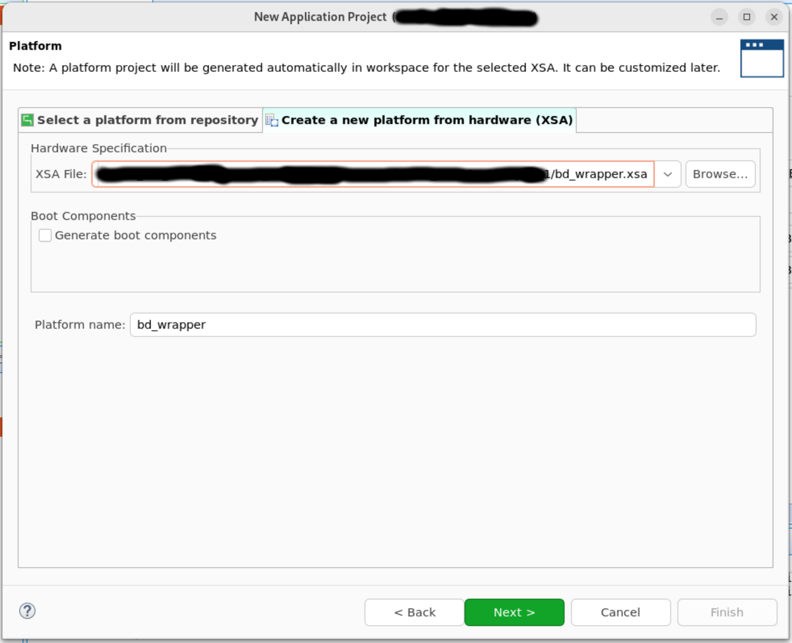
3. Build the application project: In Vitis's Explorer tab, right click the application project -> Build Project. (See the figure in step 6 of [the firmware section](#firmware))
4. Once the build is done, turn on the ZCU106 evaluation board. 
5. Once the board is on, click "Debug" button and select "Debug Configurations".
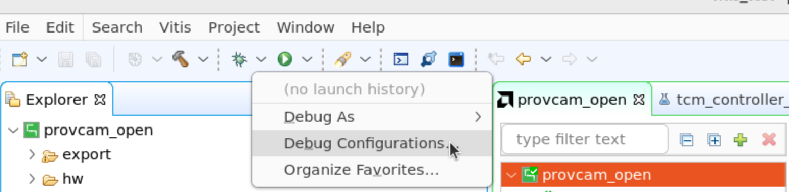
6. In the pop-up windows, right-click "Single Application Debug" and select "New Configuration".
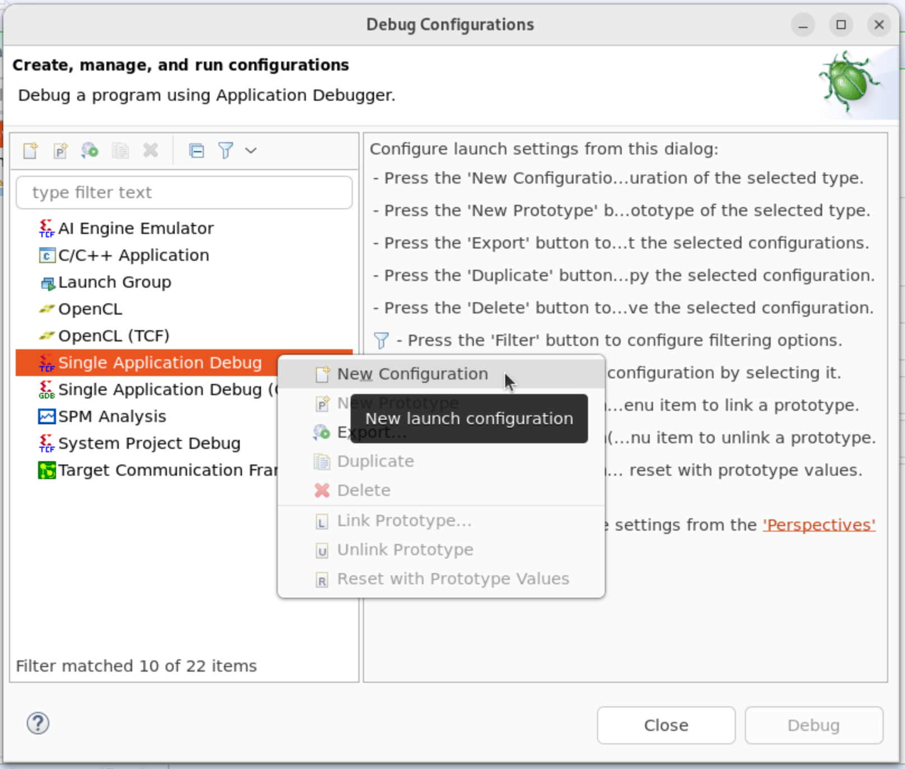
7. Configure the debug options as shown in the figure below and click "Debug".

8. Once the board is programmed and the debug is started, you Vitis should be in debug mode similar to the figure below.
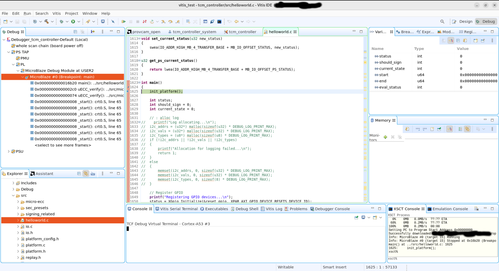
9. Turn off the board without closing Vitis. (Here we're essentially just activating Vitis's debug mode, and we will not use Vitis to program the board again)

### Running & Debugging ProvCam
Assuming you have the SD card containing the compiled images of everything of ProvCam inserted into the ZCU106 evaluation board.\
Assuming you have both CONSOLE_OS and CONSOLE_FW opened.\
Assuming you have Vitis opened in debug mode.\
This sub-section is supposed to be done using MACHINE_0.

1. Turn on the ZCU106 evaluation board. 
2. Wait for the OS to boot up and you should see the OS's booting log in CONSOLE_OS and the firmware's booting log in CONSOLE_FW.
3. Once the OS is booted, you should see the OS's login prompt in CONSOLE_OS.
4. Login to the OS using the default username and password (both are "root").

## References

https://docs.xilinx.com/v/u/en-US/dh0013-vivado-installation-and-licensing-hub
https://docs.xilinx.com/r/en-US/ug1144-petalinux-tools-reference-guide/Introduction
https://www.xilinx.com/products/boards-and-kits/zcu106.html
https://leopardimaging.com/product/platform-partners/amd/li-imx274mipi-fmc/
https://xilinx-wiki.atlassian.net/wiki/spaces/A/pages/460948332/Zynq+UltraScale+MPSoC+VCU+TRD+2020.1
